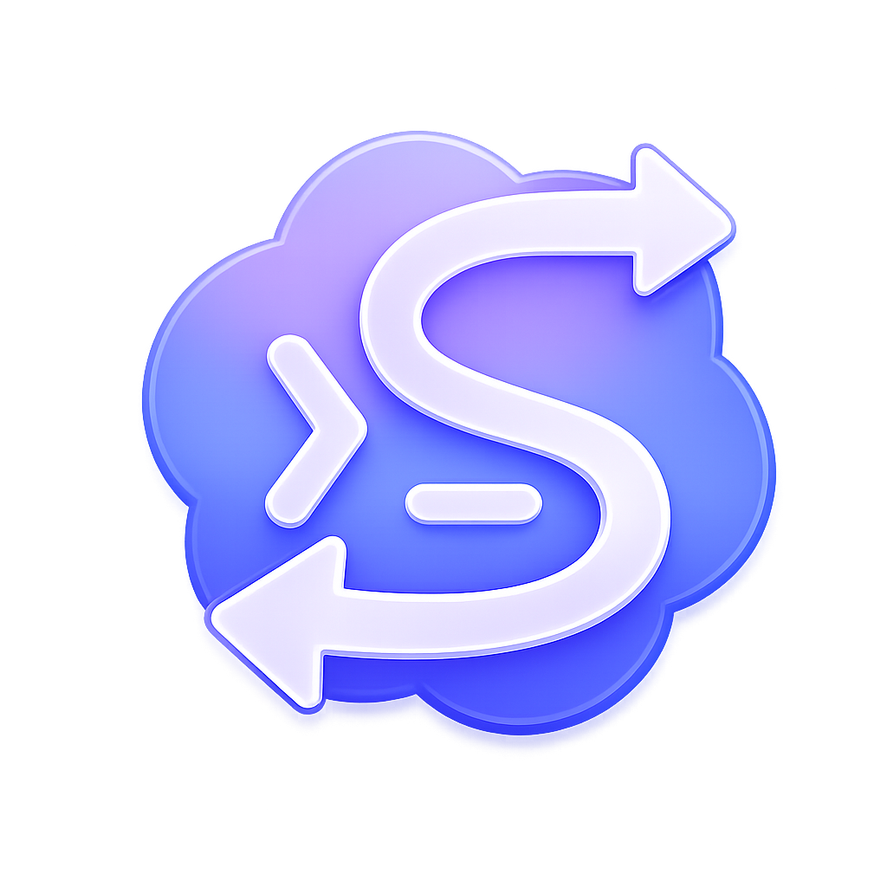
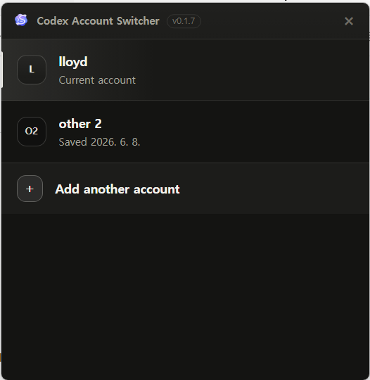
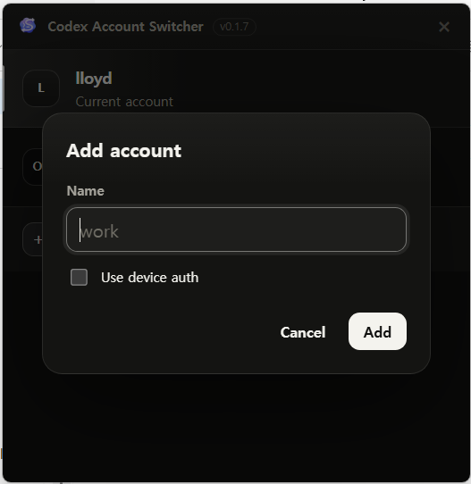
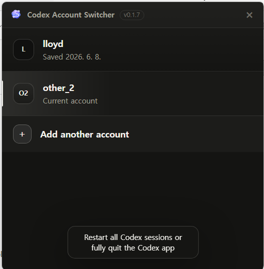

<p align="center">
  
</p>

<h1 align="center">Codex Account Switcher</h1>

<p align="center">
  여러 Codex 계정을 로그아웃 없이 바꿔 쓰기 위한 작은 데스크톱 앱입니다.
</p>

<p align="center">
  <a href="https://github.com/xeon-lloyd/codex-account-switcher/releases/latest">
    
  </a>
</p>

<p align="center">
  
  
</p>

<p align="center">
  
</p>

<p align="center">
  <sub>저장된 계정을 고르고, 새 계정을 추가하고, 클릭 한 번으로 현재 Codex 계정을 바꿉니다.</sub>
</p>

<p align="center">
  <strong>앱에서 동작</strong><br>
  
</p>

<p align="center">
  <strong>CLI에서 동작</strong><br>
  
</p>

## 이 앱은 무엇인가요?

Codex Account Switcher는 Codex CLI 또는 Codex 앱을 여러 계정으로 사용하는 사람을 위한 계정 전환 도구입니다.

보통 Codex는 현재 로그인된 계정 하나만 사용합니다. 다른 계정을 쓰려면 로그아웃 후 다시 로그인해야 해서 번거롭습니다. 이 앱은 각 계정의 Codex 로그인 정보를 이름이 붙은 프로필로 저장해 두고, 클릭 한 번으로 현재 사용할 계정을 바꿔 줍니다.

예를 들어 이런 식으로 사용할 수 있습니다.

- `personal`: 개인 작업용 계정
- `work`: 회사 작업용 계정
- `client-a`: 특정 프로젝트용 계정

## 다운로드 및 설치

최신 버전은 GitHub Releases에서 받을 수 있습니다.

👉 [최신 릴리스 다운로드](https://github.com/xeon-lloyd/codex-account-switcher/releases/latest)

### Windows

1. Releases 페이지에서 `Codex-Account-Switcher-...-win-x64.exe` 파일을 다운로드합니다.
2. 다운로드한 설치 파일을 실행합니다.
3. Windows SmartScreen 경고가 나오면 앱 이름과 출처를 확인한 뒤 계속 진행합니다.
4. 설치가 끝나면 **Codex Account Switcher**를 실행합니다.

### macOS

1. Releases 페이지에서 `Codex-Account-Switcher-...mac-x64.dmg` 파일을 다운로드합니다.
2. DMG를 열고 앱을 Applications 폴더로 옮깁니다.
3. 앱을 실행합니다.
4. macOS에서 확인되지 않은 개발자 경고가 나오면 시스템 설정의 **Privacy & Security**에서 실행을 허용하거나, 앱을 우클릭한 뒤 **Open**으로 실행합니다.

> macOS 빌드는 현재 서명/공증이 적용되지 않을 수 있습니다. 배포 방식이 개선되기 전까지 Gatekeeper 경고가 표시될 수 있습니다.

## 처음 사용하는 방법

### 1. 계정 추가하기

앱을 열고 **Add another account**를 누릅니다.

<p align="center">
  
</p>

계정 이름을 입력합니다. 이름은 나중에 구분하기 쉬운 값이면 됩니다.

예시:

- `personal`
- `work`
- `team-main`

이름을 입력한 뒤 **Add**를 누르면 Codex 로그인이 시작됩니다. 브라우저가 열리면 사용할 OpenAI 또는 ChatGPT 계정으로 로그인하세요. 로그인이 끝나면 해당 계정이 프로필로 저장되고, 바로 현재 계정으로 선택됩니다.

### 2. 다른 계정도 추가하기

같은 방식으로 **Add another account**를 다시 눌러 다른 계정도 추가합니다.

브라우저가 계속 같은 ChatGPT 계정으로 로그인하려고 한다면 다음 방법 중 하나를 사용하세요.

- 앱에서 **Use device auth**를 체크하고 기기 인증 방식으로 로그인합니다.
- 브라우저에서 다른 프로필을 사용합니다.
- 브라우저의 기존 ChatGPT/OpenAI 계정에서 로그아웃한 뒤 다시 시도합니다.

### 3. 계정 전환하기

앱에 저장된 계정 목록에서 사용할 계정을 클릭하면 전환됩니다.

<p align="center">
  
</p>

전환한 뒤에는 이미 실행 중인 Codex 세션이 이전 로그인 정보를 계속 들고 있을 수 있습니다. 계정을 바꾼 뒤에는 터미널의 Codex CLI 세션이나 Codex 앱을 완전히 종료한 뒤 다시 실행하세요.

### 4. 계정 삭제하기

계정 목록에서 삭제할 계정 위에 마우스를 올리고 `×` 버튼을 누르면 저장된 프로필을 삭제할 수 있습니다.

현재 사용 중인 계정은 바로 삭제할 수 없습니다. 먼저 다른 계정으로 전환한 뒤 삭제하세요.

## 알아두면 좋은 점

- 이 앱은 로컬 데스크톱 유틸리티입니다.
- OpenAI API를 직접 호출하지 않습니다.
- Codex 로그인 파일의 내용을 앱 화면에 표시하지 않습니다.
- 저장된 프로필은 인증 정보입니다. 다른 사람에게 공유하거나 GitHub에 올리지 마세요.
- 계정 전환 후 Codex CLI 또는 Codex 앱을 다시 시작해야 변경이 반영됩니다.
- 패키지 앱은 실행 시 GitHub Releases에서 업데이트를 확인하고, 업데이트가 다운로드되면 앱을 종료할 때 설치합니다.

## 자주 묻는 질문

### 기존 Codex 로그인이 사라지나요?

일반적인 전환 과정에서는 기존 인증 파일을 저장된 프로필과 비교하고, 알 수 없는 인증 파일은 `~/.codex/account-switcher/backups`에 백업합니다.

그래도 인증 파일은 계정 접근과 관련된 민감한 파일입니다. 중요한 환경에서 사용하기 전에는 `~/.codex` 폴더를 별도로 백업해 두는 것을 권장합니다.

### 계정을 바꿨는데 Codex가 여전히 이전 계정으로 보입니다.

이미 실행 중인 Codex 세션이 이전 인증 정보를 들고 있을 수 있습니다. 터미널에서 실행 중인 Codex CLI를 종료하고 다시 실행하거나, Codex 앱을 완전히 종료한 뒤 다시 열어 주세요.

### 브라우저 로그인이 자꾸 다른 계정으로 됩니다.

브라우저에 이미 로그인된 ChatGPT/OpenAI 계정이 자동 선택되는 경우가 있습니다. **Use device auth**를 체크해서 기기 인증으로 로그인하거나, 브라우저 프로필을 분리해서 사용해 보세요.

### 저장된 계정 정보를 다른 컴퓨터로 복사해도 되나요?

권장하지 않습니다. `auth.json`은 인증 정보이므로 비밀번호처럼 다뤄야 합니다. 다른 컴퓨터에서는 앱을 설치한 뒤 각 계정을 다시 로그인해서 저장하세요.

### 앱을 삭제하면 저장된 계정도 삭제되나요?

앱 삭제만으로 `~/.codex/account-switcher` 폴더가 자동 삭제되지는 않을 수 있습니다. 저장된 프로필까지 지우려면 해당 폴더를 직접 삭제하세요.

## 기본 원리

Codex는 로그인 정보를 보통 아래 파일에 저장합니다.

- Windows: `%USERPROFILE%\.codex\auth.json`
- macOS: `~/.codex/auth.json`

Codex Account Switcher는 이 파일을 직접 해석하거나 화면에 보여 주지 않습니다. 대신 로그인된 `auth.json` 파일을 계정별 프로필 폴더에 복사해 두었다가, 사용자가 계정을 선택하면 해당 프로필의 파일을 다시 Codex의 기본 위치로 복사합니다.

저장 위치는 다음과 같습니다.

```text
~/.codex/account-switcher/
├─ profiles/
│  ├─ personal/auth.json
│  └─ work/auth.json
└─ backups/
```

이미 있던 Codex 로그인 파일이 어느 저장된 프로필과도 일치하지 않으면, 앱은 덮어쓰기 전에 `backups` 폴더에 백업을 남깁니다.

## 개발자용

일반 사용자는 이 섹션을 읽지 않아도 됩니다. 소스에서 직접 실행하거나 릴리스를 빌드할 때만 필요합니다.

### 요구 사항

- Node.js 20 이상
- Windows 10/11 또는 macOS

패키지 빌드는 `@openai/codex`와 플랫폼별 Codex 실행 파일을 함께 포함합니다. 개발 중 다른 Codex 실행 파일을 사용하려면 앱 실행 전에 `CODEX_BIN` 환경 변수에 전체 경로를 지정할 수 있습니다. Codex가 관리하는 환경에서 실행되는 경우 `CODEX_CLI_PATH`가 있으면 자동으로 사용합니다.

### 로컬 실행

```bash
npm install
npm start
```

### 패키징

Windows:

```powershell
npm run build:win
```

macOS:

```bash
npm run build:mac
```

## 보안 메모

저장된 프로필은 Codex 인증 파일의 복사본입니다. `~/.codex/account-switcher` 폴더를 공유하거나 저장소에 커밋하지 마세요.

## 라이선스

이 프로젝트는 AGPL-3.0 라이선스를 따릅니다. 자세한 내용은 [LICENSE](../LICENSE)를 확인하세요.
